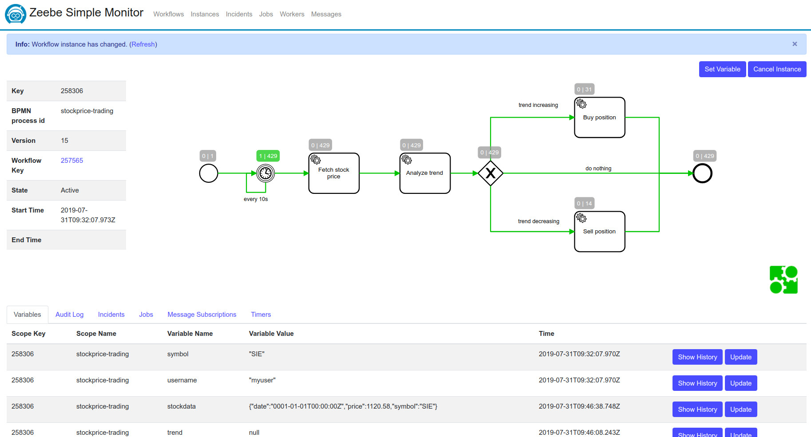

# playground-workflow-engine

A playground project to learn Zeebe and Go

 

**Zeebe order-process tutorial**  

  https://docs.zeebe.io/getting-started/README.html  

  `docker-compose up`

- Enter container and deploy workers

  `docker exec -it zeebe sh`

  `zbctl create worker payment-service --handler cat &`  
  `zbctl create worker inventory-service --handler cat &`    
  `zbctl create worker shipment-service --handler cat &`

- Zeebe simple monitor: [http://localhost:8000]()

- Zeebe monitor db: [http://localhost:81]()

- Deploy `order-process.bpmn` or create instance by using:  
`zbctl create instance order-process --variables '{"orderId": 12345}'`

 

**stockprice-trading demo**  

- Start Zeebe infrastructure (from project's root folder):  
  `sudo rm -r localdata/` (if needed)  
  `docker container prune`
  `docker-compose up`

- Start workers as Go process:  
  `(cd stockprice-service && go run cmd/main.go)`  
  `(cd trend-analyser && go run cmd/main.go)`  
  `(cd trading-service && go run cmd/main.go)`  
  (or by building docker images with `make build-image` and running `docker-compose -f docker-compose-workers.yml up`)  
  See the registered workers on Zeebe Simple Monitor at [http://localhost:8080/views/workers]()

- Create account for user `myuser` and configure trading limits
  `curl -X POST http://localhost:9200/api/accounts -H "Content-Type: application/json" -d '{"username": "myuser", "balance":1500}'`    
  `curl -X PUT http://localhost:9200/api/accounts/myuser/limit -H "Content-Type: application/json" -d '{"SIE": {"priceLimit": 800, "balanceLimit": 500}}'`  
  Check the config at http://localhost:9200/api/accounts/myuser  
  Change your balance by using deposit/withdraw operations  
  `curl -X POST http://localhost:9200/api/accounts/myuser/deposit?amount=100.1`

- Deploy a new workflow by uploading [zeebe/bpmn_files/stockprice-process.bpmn]() on Zeebe Simple Monitor  
  Open the deployed workflow and create a new instance with this data `{"symbol": "SIE","username": "myuser"}`  
  You should see in the process logs that the workers are receiving data, and messages are passing through the workflow

  

 

- The process is checking the price of SIE (Siemens) stock by calling the mocked stockprice service at this url   
  `http://localhost:9000/api/company/real-time-price/{SYMBOL}[?trend={-1|0|1}]`  
  You can change the trend for the random price (-1 = decreasing | 0 = stagnate | 1 = increasing)  
  Check the fetched stock data at `http://localhost:9100/api/stockdatas/{SYMBOL}[?offset={number}&limit={number}]`  
  The fetched price is analysed with a dummy trend analyser and it sends the trend forward where the condition routes the 
  action to sell or buy positions.

